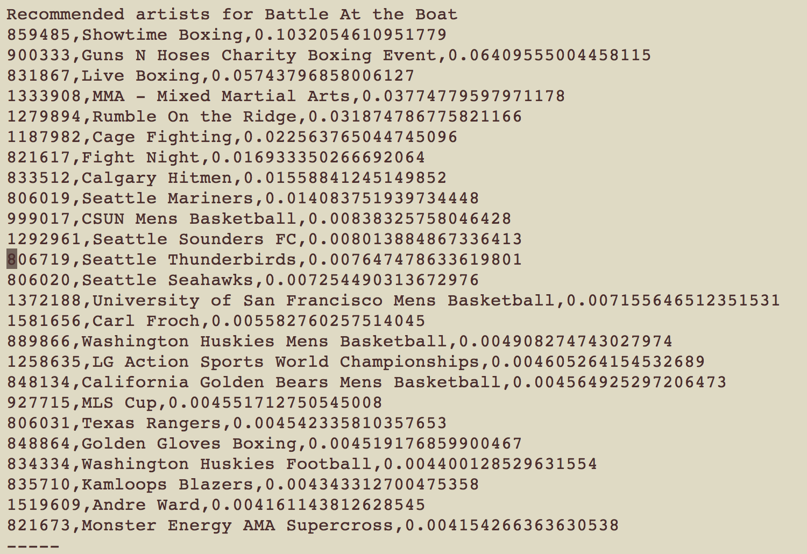
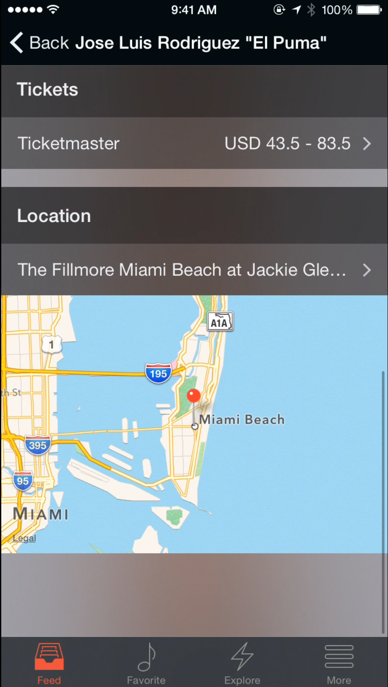
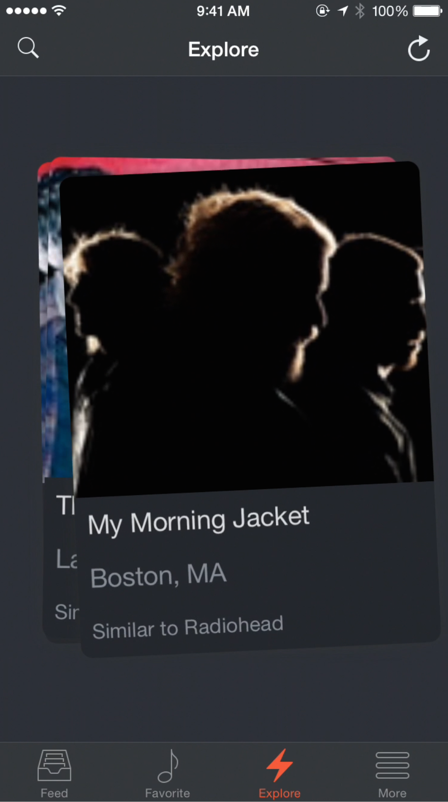

# UCLA CS130 Ticket Tonight's requirement document

Introduction
=============

Purpose
-------

The purpose of this Software Requirement Specifications (SRS) document
is to provide a description about the features and use cases of the
Tickets Tonight App 1.0. It will cover all functional and nonfunctional
requirements of the product, as well as its UI and technologies being
used. This document also details the internal software interfaces and
external dependencies and interfaces. This document will describe the
whole application system.

Project Scope
-------------

The goal of Tickets Tonight, as its name suggests, is to provide event
recommendation, event search and ticket purchase service which are
oriented to last minute decisions. Ticketmaster has been generally
viewed as an endpoint for users to simply purchase the tickets to an
event they already have in mind. Now, with this application,
Ticketmaster can extend its services to even the event choosing phase
and event discovery phase of a user’s whole purchasing process.
Ticketmaster can better refine and cater to users who want to buy
tickets at the last minute. Ticketmaster has provided sample data
through xml files that contain artist, venue, category, and events data.
Ticketmaster has also provided affinity data which denotes several
recommended artists and their scores for a given artist. These data will
be used to generate events available and provide users recommendations.
Tickets Tonight will also send notifications to inform users about
events which are still available tonight, based on users’ location,
preference, event date and budget, and lead users to ticket purchase
page once they have decided to go.

References
----------

Tickets Tonight will use [Parse.com](https://parse.com/) to store the
data provided by Ticketmaster. In order to access the data stored,
Ticket Tonight will use Parses [iOS
SDK](https://parse.com/docs/ios_guide#top/iOS). To parse the given data
from Ticketmaster, we will be using the python [XML
library](https://docs.python.org/2/library/xml.etree.elementtree.html)
and [JSON library](https://docs.python.org/2/library/json.html). Ticket
Tonight app also uses iOS view controller, including
[TabBarController](https://developer.apple.com/library/ios/documentation/WindowsViews/Conceptual/ViewControl
	  	lerCatalog/Chapters/TabBarControllers.html) and
[TableView](https://developer.apple.com/library/ios/documentation/UserExperience/Conceptual/TableView_
	  	iPhone/CreateConfigureTableView/CreateConfigureTableView.htm). In
order to populate the location map on Apple Maps, we use the [CLGeocoder
object](https://developer.apple.com/library/mac/documentation/CoreLocation/Reference/CLGeocoder_
	  	class/index.html)

Overall Description
===================

Product Perspective
-------------------

Tickets Tonight is a follow-on member of Ticketmaster’s mobile app for
ticket sales. Ticket Tonight will be focused and catered to users making
last minute decisions to go to an event. Tickets Tonight will use the
event, artist, category, venue, and affinity data provided by
Ticketmaster to achieve its purpose. The data given by Ticketmaster will
allow the Tickets Tonight to provide the user actual events that they
may be interested in. If Ticketmaster desires, this application could be
integrated with their actual database instead of pre-generated data. In
order to better cater to the user, the application will use the user’s
favorite artists to generate more relevant recommendations of events.
Ticketmaster could later link their user database to this application
but without any given API, this version of Tickets Tonight will generate
its own user group separate from Ticketmaster users. Tickets Tonight’s
user data and favorite artists will be stored on Parse. For preliminary
and testing purposes, the application will use anonymous users and will
not store actual user favorites.

Production Features
-------------------

The overall application will have a Feed view, a Favorites view, a
Explore view and a Settings(More) view. More details of the following
views will be provided in Section 3. The following descriptions provide
a high level summary. Each of the following views will be a view inside
a UI tab bar controller object in the app. The views will be accessible
through tabs on the bottom.

Feed View: In this view, the user would be able to see the events of
their favorite artists and the events will be ordered by date. This view
will be separated into recent, favorite and following tabs. The recent
tab of the feed view will display the events that are happening near the
user (if location turned on) and events will be sorted by date. The
favorite tab in the feed view allows the user to view his or her
favorited artists’ recent events. In addition, there is also the
following tab which allows the user to easily track the events that he
or she has followed. The events that the user has followed could be
events he or she is going or simply the user just wants to track it.
Furthermore, if the event that the user is following changes location,
the user can easily track that change and get notified.

Favorites view: In this view, the user would be able to see the artists
they have selected as their favorite artists. The user would be able to
click on any of the artist cells and untoggle the favorite selection if
he or she so desires. At the top of this view the user can also manually
search for artists by their names to find the artist the user wants to
add and start tracking. The search will research and refine the results
as the user types in letters. For each key stroke we can further reduce
the result pool and create a almost search-auto complete feature.

Explore view: In this view, the user will be provided a slide card
presentation of potential events that the user may be interested in. The
user can slide away the cards if the user is not interested. The events
presented in this view is generated through the affinity data by first
joining the lists of artists that are similar to the user’s favorite
artists, then finding events performed by those related/similar artists.
If the user does not have a lot of favorite artists, the slide cards
could eventually be emptied since the given data from Ticketmaster is
not as expansive as their actual database. In the case where the cards
are all swept out, there is a refresh button on top for the user to
reset.

Settings view: In this view, the user will be able to search artists by
category, toggle location control and a logout button. The logout button
currently does not implement actual logging out or logging in action
since this application will be using anonymous users hence the user
favorite data will be stored locally on the phone. There is also another
tab to allow the user to access the events nearby directly listing out
all events nearby.

User Classes and Characteristics
--------------------------------

Currently the main type of user will be potential ticket buyers. They
will be notified when an event would be a good match for them based on
their favorite artists and affinity data. The main user base will likely
be users who intend on going to events last minute and have not made
plans. These types of users are typically whimsical or perhaps are from
out of town. This user class could potentially also be people who had
plans cancelled and need to kill time. They would benefit from the
explore view that generates events of artists relatable to their
favorite artists based on the affinity data. These are our favored user
class. Another user class could be event planners that are planning an
event for their customer and intend on avoiding conflicts with other
popular events or other similar artists’ events. In other words, these
users use the application to find out openings and times that they could
host their own events without coming into conflicting with other events.
These users are not the primary users that Tickets Tonight want to
satisfy as they will not likely be purchasing tickets from Ticketmaster.

Operating Environment
---------------------

Initially, the Tickets Tonight app will be built for Apple’s iOS 8
mobile operating system, but will be supported on devices with Apple’s
iOS 7.0 and later. It will support all devices running iOS 8, including
the new iPhone 6, iPhone 6 Plus, iPad Air 2, and iPad mini 3. The app
will take advantage of these new display sizes and utilize the device’s
location and TouchID sensors for a better user experience in receiving
recommendations and completing ticket purchases. Given enough market
demand, an Android version of the app will be developed. Tickets Tonight
will also heavily rely on Parse to provide cloud services and database
access on the mobile app. This software infrastructure may need to be
changed if future versions decide to steer away from Parse and
potentially Ticketmaster may want to provide its own infrastructure for
database access.

Design and Implementation Constraints
-------------------------------------

One big limitation is the lack of access to the actual database of
Ticketmaster. There is also no API’s to allow logging in to Ticketmaster
or querying a user’s favorite artists. As such, the Tickets Tonight app
will resort to creating its own user and have only the favorite artists
stored for each user. This could limit Tickets Tonight’s portability in
the future when it connects to the actual database instead of Parse.
Using Parse, Tickets Tonight conforms to Parse’s iOS SDK infrastructure
interface to store and query data. If an android app is to developed
next, Parse also provides an infrastructure and Android SDK that could
use the same Parse objects created for this app. Since no information
has been given for the database, we also do not know how data curation
occurs and how the affinity data will be generated. This limits
portability as we cannot design how new information can be pipelined to
update the data the app queries on Parse. Without actually connecting to
Ticketmaster, the user cannot make an in app purchase and thus would be
directed to the event page through their mobile device’s web browser.
Another concern is security constraint involving parsing the XML file.
If future data curation is continued through xml parsing through python
then there is a security risk because python’s xml module is not secure
against maliciously constructed data. Another constraint is that since
Tickets Tonight is a mobile app and it requires accessing Parse,
internet connection will be required. If the user is in a weak signal
strength area then the app will have to rely on cached results that
could be very outdated depending on when the app was last launched.

### Ticketmaster Data Feeds

Ticketmaster did not provide us with an API to access their data, but
instead provided us with two static data files: 1) an event info data
feed formatted as an XML file and 2) an affinity feed formatted as a
simple text file. Our implementation parses these data files and hosts
them as Parse objects (*PFObject*), essentially a database (key-value
pairs of JSON-compatible data), on Parse. Tickets Tonight will connect
to Parse through the iOS SDK which provides access to objects on Parse
through a query object (*PFQuery*).

#### Event Info Data Feed

Ticketmaster provided us with a 118.9MB XML file that includes a list of
artists, event venues, event categories, and event information. The XML
file is parsed through Python’s built in XML module and uploaded to
Parse to allow the application to access the data through Parse’s IOS
SDK. The data feed is parsed into four sub trees. On Parse, there is the
artist subtree, venues subtree, category subtree and events subtree. A
section of the data file is displayed below.

For each artist, Ticketmaster has provided us the artist id, the
category to which this artists belongs, an URL to the artist’s image
(low resolution), the artist name, and an URL to the artist page on
Ticketmaster’s website.

For each venue, Ticketmaster has provided us the city of the venue, the
state of the venue, the street of the venue, an URL to the venue’s
image, the name of the venue, an URL to the venue’s page on
Ticketmaster’s website and the zip code of the venue.

For each event, Ticketmaster has provided us the event id, the performer
ids (artist ids), the category id of the event, the event date, event
status, event time, on sale date, performance name, the URL to the
Ticketmaster page, and the venue id.

#### Affinity Data Feed

The affinity data provided by Ticketmaster is a 11.1MB text file. The
file contains an entry for artists. Each artist’s entry has a list of
scores and corresponding artists. The artists under an entry are the
recommended artists for the artist in question and each recommended
artist is associated with a score ranging from 0 - 1.

The format of the file is

{ *ArtistName*
{*RecArtistID, RecArtistName, Score*}\* }*

“RecArtistID” can be related to the artist information in the event info
data feed we have. The second value is the name of the recommended
artist. The third value is the score ranging from 0-1, with higher score
meaning that the recommended artist is a better match than other artists
with lower scores. This file is parsed using our custom Python script
and stored on Parse.

###  Assumptions and Dependencies

The major dependency for Tickets Tonight is its reliance on Parse.
Tickets Tonight queries the data on Parse in order to generate its feed
and explore views. If Parse cannot provide reliable service then the
application interface with Parse will have to be changed and another
form of data interface would be needed.

External Interface Requirements
===============================

User Interfaces
---------------

Tickets tonight will follow iOS human interface guideline. Tickets
Tonight has two major views, Feed and Explore. The views are contained
in a tab bar controller object and the user is given tabs at the bottom
of the screen to change into the views. In the Feed view, the user can
view events of the artists in their favorites. Each event is displayed
as a cell with the image of the event on the left followed by the title
and performer text in the middle of the cell. The cells are in iOS table
layout. If the user clicks on the cell, then the event information view
is displayed in an event view page which displays the image of the event
at the top followed by the date of the event, follow toggle for the
event (places the event under the following tab in Feed view), the
ticket price range, and the location of the event. If the data provides
the ticket URL, then by clicking on the ticket price cell, the app will
start an in-app embedded browser that allows the user to buy the ticket
on Ticketmaster’s website. The location of the event is followed by a
cell of Apple Maps that pins the event on the map. In the artist view
page the user can favorite or unfavorite the artist. The artist page
displays the artist name on top followed by his or her picture and event
cells of the artist. In the Explore view, the user is presented events
of not only his or her favorites but also events of artists recommended
by their favorites’ affinity data. The events are displayed in a
seemingly flashcard form that the user can swipe away or click on. Each
card displays the event image in the top center and the performer image
and location at the bottom of the card. The card will also indicate who
this artist is similar to. In the more tab, the user can find artists by
category and also query all the events that are near his or her current
location directly.

Software Interfaces
-------------------

### Parse Interfaces and Parse iOS SDK

Tickets Tonight connects to Parse services in order to access the data
provided by Ticketmaster. The Parse iOS SDK connects the app to Parse if
the application id and client key is provided. The data from the XML and
the affinity text file is parsed by python and stored on Parse as
*PFObjects*. Each *PFObject* contains key-value pairs of JSON-compatible
data. This data is schemaless, which means that we don’t need to specify
ahead of time what keys exist on each *PFObject*. We simply set the
key-value pairs we want, and the Parse backend will store it. The
*PFObject* has a method to save the data to the Parse backend and the
data can be viewed on the Parse app page data browser section. A sample
is shown in the following image.

1. 

Tickets Tonight will query the data stored on Parse through a *PFQuery*
object that returns the *PFObject* on Parse. The *PFQuery* can find the
*PFObject* if given the object id which will be created as a field when
the *PFObject* is instantiated. Tickets Tonight can save the user’s
favorite artists through similar means of querying the *PFObject* and
modifying it then saving it. Saving a *PFObject* to the Parse server can
be done offline as well, where we call the *saveEventually* method on
the object and the method will store the update on the device until a
network connection is re-established.

The aforementioned interfaces of Parse outlines the overall
infrastructure of communication and how Parse is used. More detailed
documentation of each various method and relationships on query and
object can be found in References. The data on Parse are used
to generate the cells in the Feed view and the cards in the Explore
view. For the Feed view of Tickets Tonight, we query the user’s favorite
artists and then query their events and then order them by date and
display in the Feed view. For the Explore view of Tickets Tonight, we
query the user’s favorite artists and then query the affinity data to
find recommended artists based on the user’s favorite artists. Once we
have the recommended artists, we query their events and generate the
cards for each of their event. When the user adds an artist to his or
her favorite, the data is also saved to Parse.

### iOS Application Interfaces

In the actual application, each view, is handled by the UI Tab Bar
controller object. The UI Tab Bar controller object displays a view
corresponding to the tab selected at the bottom of the screen. Each view
contained in the tab bar controller object will be linked by the tab.
Under the UI Tab Bar controller object we have a Feed view controller,
Favorite view controller, Explore view controller, and settings view
controller. These view controllers are all table view controllers. Table
view controllers in iOS displays table cells. We populate the tables
views with Image table view cells which contain an image and text to the
right of the image. In the Feed table view controller, we populate the
view with Event cells which contain the image of the event and the title
of the event. In Favorite table view controller we populate the view
with artist cells which contain the image of the artist and the name of
the artist. The event cells and artist cells lead to event views and
artist views respectively. In the event views we display the image,
artist, ticket URL and the location of the event. In the artist views we
display the image of the artist and events the artist has. In order to
populate the cells with actual data, we query the data on Parse through
the aforementioned Parse interface. By querying Parse with the *PFQuery*
object we can obtain the data we need in order to populate the cells.
For detailed description of the object methods, the documentation for
view controller objects for iOS is included in the reference section. In
order to display the map in the events page, we convert the address to a
geopoint using the *CLGeocoder* object and using it we could mark the
venue on to the map. In order to open the URL inside the app, we create
a webview to display it. In addition, when we query the data needed for
the explore view, we first obtain the favorite artists objects then
flatten them to names in order to query the affinity data, then acquire
recommended artists objects, then flatten those objects into int ID’s,
convert those ID’s into strings, then query the events and finally
exclude the events that the user are already following.

### Python parser

For the data given to us by Ticketmaster, we use Python to parse them
into essentially a JSON format to upload to Parse into Parse objects.
For the XML we use the Python library to parse the XML into a tree like
objects and create csv objects. For the text file containing affinity
data, which was almost a csv file, we also use the python library to
parse it into JSON formatted objects. These objects are then uploaded to
Parse. Parse accepts csv and JSON to populate Parse objects. More
detailed description for each of the python library methods can be found
in the reference section. We parse the XML into a csv but the affinity
data into JSON because for the affinity data, an artist can have an
array of recommended artists and each artist has a different length of
array. CSV requires column number to be the same for each entry. We
could have also put all the recommended artist into one long string in a
column for the CSV however, we chose JSON in order to gain easier access
and without having to parse a string.

Project Experience
==================

Project Design and Difficulties
-------------------------------

Our initial design for the project was under the assumption that we
would be receiving access to Ticketmaster’s database and API. Under this
assumption, we wanted to create a great overall experience that would
allow the user to actually be able to purchase the ticket through the
app and connect to their Ticketmaster account in order to synchronize
the product line. Our original design was using node.js as our server in
order to retrieve data from Ticketmaster and have node.js serve as our
platform for the data we needed on the app. We also originally wanted to
connect the user favorites data to the user account on Ticketmaster’s
website so ended up using an anonymous user and store favorites locally.

One difficulty we had was the designing of the whole application. We
really wanted an intuitive way to be able to present the data to the
users. Another difficulty we had was combining all the data into a
coherent application. Initially we thought about combining all the data
to formulate the best recommendation for the user. Another difficulty
was converting an actual address to a geopoint in order to mark the
location on the map. We needed the geopoint of the location instead of
addresses and currently we do this conversion on the mobile device. We
could potentially convert all the event locations and save their
geopoint instead of the address string.
